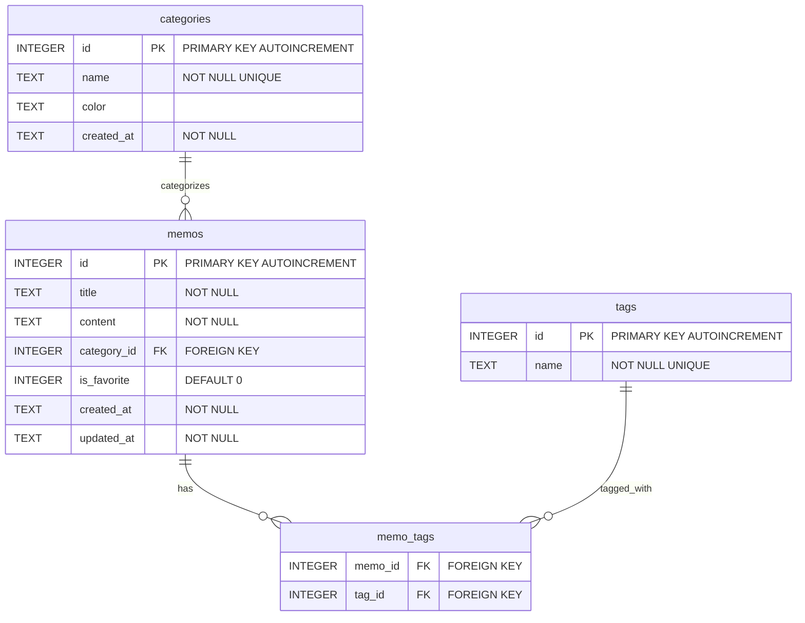

# ai-MyMemo データベースER図

## データベース構造図

## テーブル関係

### 1. categories → memos (1:N)
- 1つのカテゴリーは複数のメモを持つことができる
- 1つのメモは1つのカテゴリーに属する（またはカテゴリーなし）

### 2. memos ↔ tags (N:M)
- 1つのメモは複数のタグを持つことができる
- 1つのタグは複数のメモに付けることができる
- 中間テーブル`memo_tags`で多対多関係を実現

## フィールド詳細

### categories テーブル
- `id`: カテゴリーの一意識別子
- `name`: カテゴリー名（重複不可）
- `color`: カテゴリーの表示色
- `created_at`: 作成日時

### memos テーブル
- `id`: メモの一意識別子
- `title`: メモのタイトル
- `content`: メモの本文
- `category_id`: 所属カテゴリーID（外部キー）
- `is_favorite`: お気に入りフラグ（0または1）
- `created_at`: 作成日時
- `updated_at`: 更新日時

### tags テーブル
- `id`: タグの一意識別子
- `name`: タグ名（重複不可）

### memo_tags テーブル
- `memo_id`: メモID（外部キー）
- `tag_id`: タグID（外部キー）
- 複合主キー：(memo_id, tag_id)